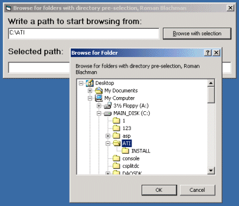



## Browse for folder with start folder pre\-selection\.

### Description

This code should show you how to browse for folder with a selected folder.

This is known from Common Dialog's start dir, where you can select from what folder to select the file(s).

In Windows you can also browse for a folder. This code helps you to learn the Browse For Folder Feature and learn how to select to start from in the Browse for folder dialog.
 
### More Info
 

             |
---                |---
**Submitted On**   |2000-03-22 01:46:14
**By**             |[Roman Blachman](https://github.com/Planet-Source-Code/PSCIndex/blob/master/ByAuthor/roman-blachman.md)
**Level**          |Advanced
**User Rating**    |4.4 (40 globes from 9 users)
**Compatibility**  |VB 5\.0, VB 6\.0
**Category**       |[Windows API Call/ Explanation](https://github.com/Planet-Source-Code/PSCIndex/blob/master/ByCategory/windows-api-call-explanation__1-39.md)
**World**          |[Visual Basic](https://github.com/Planet-Source-Code/PSCIndex/blob/master/ByWorld/visual-basic.md)
**Archive File**   |[CODE\_UPLOAD41193212000\.zip](https://github.com/Planet-Source-Code/roman-blachman-browse-for-folder-with-start-folder-pre-selection__1-6731/archive/master.zip)

